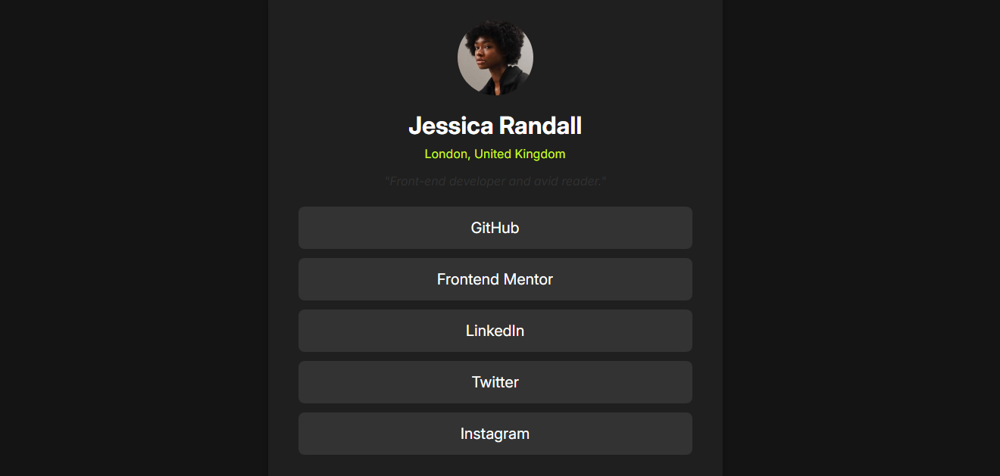

# Frontend Mentor - Social Links Profile Solution

This is a solution to the [Social Links Profile challenge on Frontend Mentor](https://www.frontendmentor.io/challenges/social-links-profile-UG32l9m6dQ). Frontend Mentor challenges help you improve your coding skills by building realistic projects.

## Table of contents

- [Overview](#overview)
  - [The challenge](#the-challenge)
  - [Screenshot](#screenshot)
  - [Links](#links)
- [My process](#my-process)
  - [Built with](#built-with)
  - [What I learned](#what-i-learned)
  - [Continued development](#continued-development)
  - [Useful resources](#useful-resources)
- [Author](#author)

## Overview

### The challenge

Users should be able to:

- View hover state for all interactive elements on the page
- Responsively view the layout on different screen sizes

### Screenshot



### Links

- Solution URL: [Solution]()
- Live Site URL: [Live Site]()

## My process

### Built with

- Semantic HTML5 markup
- CSS custom properties
- Flexbox
- SASS for CSS preprocessing
- Mobile-first workflow
- [Inter Font](https://fonts.google.com/specimen/Inter) for typography

### What I learned

While working through this project, I focused on making sure the design was responsive and accessible, using WCAG guidelines to ensure a good experience across all devices. Below is an example of SASS that made organizing CSS easier:

```scss
$primary-color: #c5f82a;

.profile-img {
  width: 6.25rem;
  height: 6.25rem;
  border-radius: 50%;
  object-fit: cover;

  @media (max-width: 375px) {
    width: 4.5rem;
    height: 4.5rem;
  }
}
```
### Continued development

In future projects, I would like to improve my skills in CSS Grid and focus more on accessibility. I found SASS extremely helpful in organizing my styles and making them more maintainable, and I plan to use it more in upcoming projects. Although I ensured hover and focus states, there's always room for refining the user experience.

### Useful resources

- [CSS Tricks - Responsive Design](https://css-tricks.com/snippets/css/a-guide-to-flexbox/) - This guide helped me structure the flexbox layout for the project.
- [SASS Documentation](https://sass-lang.com/documentation) - This was invaluable for learning SASS and how to implement it in this project.
- [WCAG Guidelines](https://www.w3.org/WAI/WCAG21/quickref/) - An essential resource for ensuring accessibility across all user interactions.
